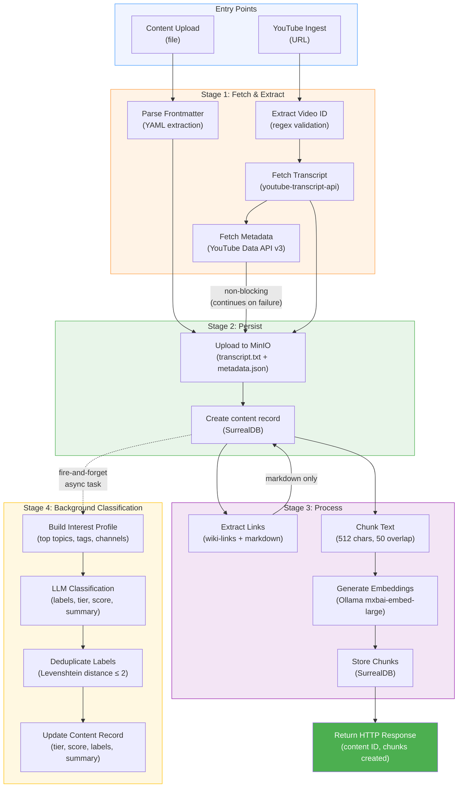
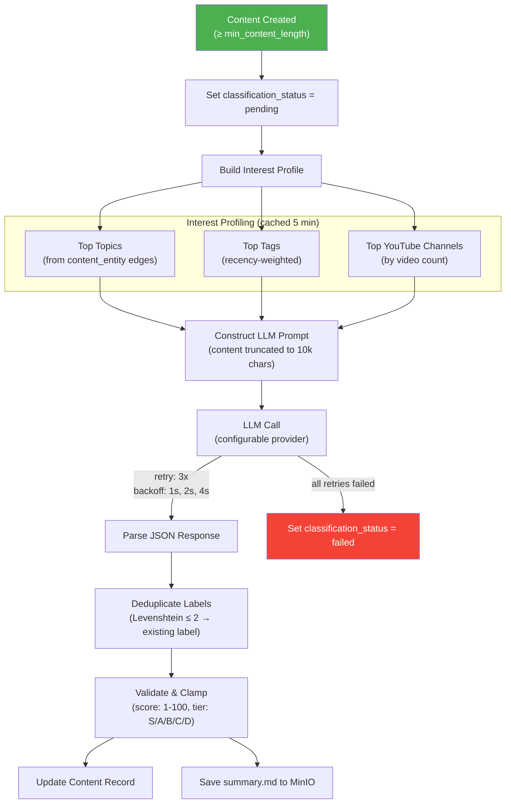

# Ingest Pipeline

## Overview

Menos supports two content ingest paths: YouTube video transcripts and general content uploads (markdown, text). Both paths converge into a shared pipeline that stores files in MinIO, persists metadata to SurrealDB, generates vector embeddings, and triggers background classification.

## Entry Points


| Entry Point | Use Case |
|---|---|
| `POST /youtube/ingest` | Ingest by YouTube URL — server fetches transcript (with optional Webshare proxy) and metadata |
| `POST /content` | General file upload (markdown, text, PDF) |
| `ingest_videos.py` | Batch ingestion from `data/youtube-videos.txt` via `/youtube/ingest` |

## Complete Pipeline Flow



## Stage Details

### Stage 1: Fetch & Extract

#### YouTube Ingest Path


**Transcript output:**
- `full_text` — plain text (all segments joined)
- `timestamped_text` — each segment prefixed with `[MM:SS]`

**Metadata extracted:** title, description, channel info, duration, view count, likes, tags, thumbnails, published date, description URLs.

#### Content Upload Path


### Stage 2: Persist to Storage


**MinIO file layout:**
```
youtube/{video_id}/transcript.txt     # Timestamped transcript
youtube/{video_id}/metadata.json      # Rich metadata (JSON)
youtube/{video_id}/summary.md         # Classification summary (added later)
content/{id}/original_filename        # General uploads
```

### Stage 3: Process

#### Link Extraction (Markdown Only)


#### Chunking & Embedding


- Chunks are word-boundary aware (breaks at last space before 512-char limit)
- Overlap of 50 characters ensures context continuity across boundaries
- Embedding failures are non-fatal — `embedding` set to `NULL`
- Only runs when `generate_embeddings=true` in the request

### Stage 4: Background Classification



**Classification output:**
| Field | Description |
|---|---|
| `labels` | Topic labels (deduplicated against existing) |
| `tier` | Quality tier: S, A, B, C, or D |
| `quality_score` | 1–100 numeric score |
| `tier_explanation` | Why this tier was assigned |
| `score_explanation` | Why this score was assigned |
| `summary` | Markdown-formatted content summary |
| `model` | Which LLM produced the result |

## Response Timeline

```mermaid
gantt
    title Ingest Response Timeline
    dateFormat X
    axisFormat %s

    section Synchronous
    Extract Video ID         :vid, 0, 1
    Fetch Transcript         :tf, 1, 4
    Fetch Metadata           :mf, 4, 6
    Upload to MinIO          :mu, 6, 8
    Create SurrealDB Record  :sr, 8, 9
    Chunk Text               :ch, 9, 10
    Generate Embeddings      :em, 10, 40
    HTTP Response Returned   :milestone, 40, 40

    section Async Background
    Build Interest Profile   :ip, 40, 45
    LLM Classification       :lc, 45, 80
    Save Classification      :sc, 80, 82
```



The HTTP response returns after embedding generation completes. Classification runs entirely in the background and does not block the response.

## Configuration

| Variable | Stage | Description |
|---|---|---|
| `WEBSHARE_PROXY_USERNAME/PASSWORD` | Fetch | Optional proxy for transcript fetching |
| `YOUTUBE_API_KEY` | Fetch | YouTube Data API v3 for metadata |
| `MINIO_URL/ACCESS_KEY/SECRET_KEY/BUCKET` | Persist | MinIO connection |
| `SURREALDB_URL/NAMESPACE/DATABASE/USER/PASSWORD` | Persist | SurrealDB connection |
| `OLLAMA_URL` | Embed | Ollama server URL |
| `OLLAMA_MODEL` | Embed | Embedding model (mxbai-embed-large) |
| `CLASSIFICATION_ENABLED` | Classify | Enable/disable background classification |
| `CLASSIFICATION_MIN_CONTENT_LENGTH` | Classify | Minimum chars to trigger classification |
| `CLASSIFICATION_MAX_NEW_LABELS` | Classify | Max new labels created per content |
| `AGENT_SYNTHESIS_PROVIDER` | Classify | LLM provider (ollama/openai/anthropic/openrouter) |
| `AGENT_SYNTHESIS_MODEL` | Classify | LLM model name |

## Error Handling

| Failure | Impact | Behavior |
|---|---|---|
| Transcript fetch fails | Fatal | Returns HTTP error, ingest aborted |
| Metadata fetch fails | Non-fatal | Continues with generic title |
| MinIO upload fails | Fatal | Returns HTTP error |
| SurrealDB write fails | Fatal | Returns HTTP error |
| Embedding generation fails | Non-fatal | Chunk stored with `embedding = NULL` |
| Classification LLM fails | Non-fatal | Status set to `failed`, no classification data |
| Classification cancelled (shutdown) | Non-fatal | Status set to `failed`, logged as warning |
