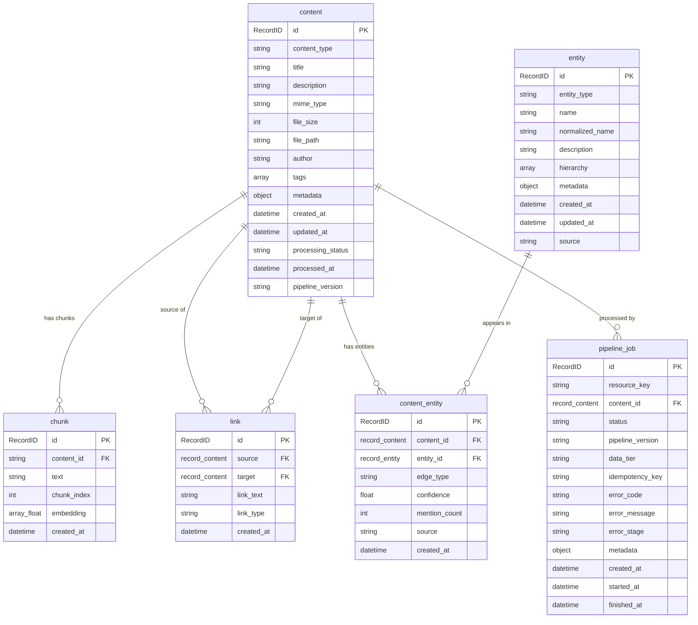
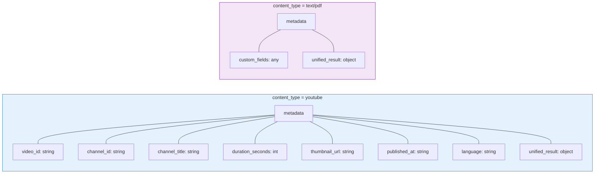
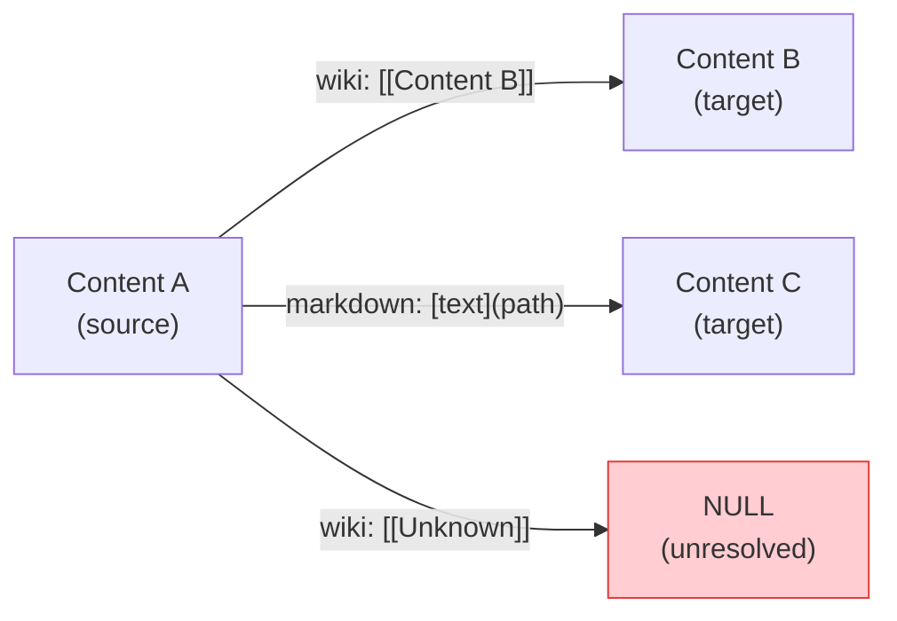
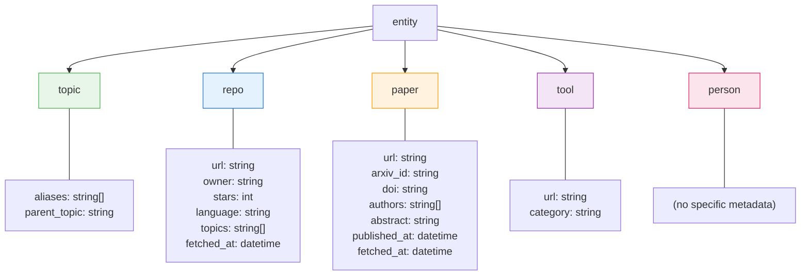
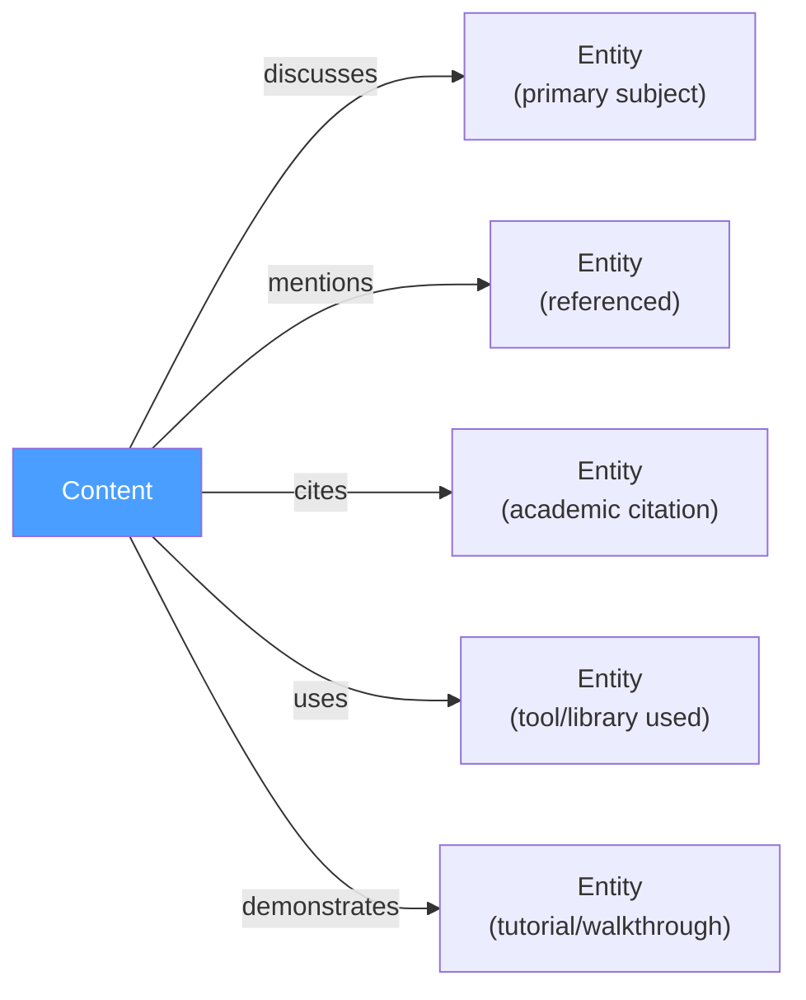
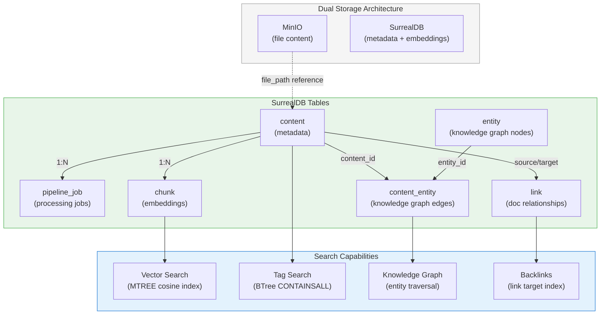
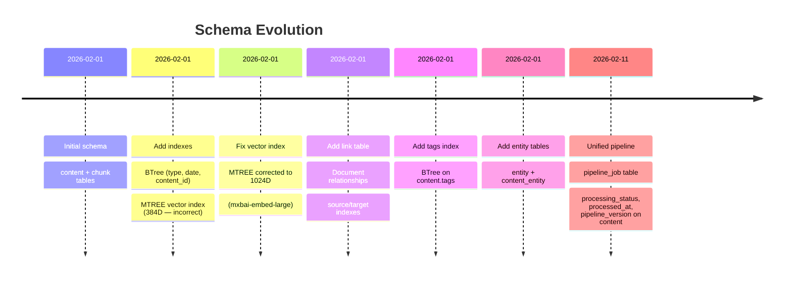
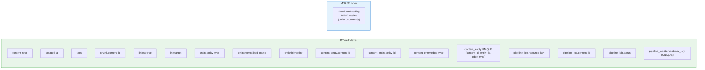

# SurrealDB Schema

## Overview

Menos uses SurrealDB in SCHEMAFULL mode (strict field definitions) for all metadata, embeddings, and relationship storage. MinIO handles file content separately. The schema supports content management, vector semantic search, knowledge graphs (entities), and unified pipeline processing with job tracking.

## Entity Relationship Diagram



## Tables

### content

Primary metadata table for all ingested items. Each record represents one document, transcript, or uploaded file.

| Field | Type | Default | Notes |
|---|---|---|---|
| `id` | RecordID | auto | `content:ulid` |
| `content_type` | string | required | `"youtube"`, `"pdf"`, `"text"` |
| `title` | option\<string\> | — | From frontmatter or YouTube metadata |
| `description` | option\<string\> | — | YouTube description or manual |
| `mime_type` | string | required | e.g. `"text/plain"` |
| `file_size` | int | required | Bytes (from MinIO) |
| `file_path` | string | required | MinIO object path |
| `author` | option\<string\> | — | Uploader key ID |
| `tags` | array | `[]` | User-defined and LLM-assigned tags |
| `metadata` | object | `{}` | Content-type-specific fields (see below) |
| `created_at` | datetime | auto | UTC |
| `updated_at` | datetime | auto | UTC |
| `processing_status` | option\<string\> | — | `pending` → `processing` → `completed` / `failed` |
| `processed_at` | option\<datetime\> | — | Last processing timestamp |
| `pipeline_version` | option\<string\> | — | Pipeline version that processed this content |

**Indexes:**

| Index | Type | Fields | Purpose |
|---|---|---|---|
| `idx_content_type` | BTree | `content_type` | Filter by type |
| `idx_content_created_at` | BTree | `created_at` | Time-based queries |
| `idx_content_tags` | BTree | `tags` | Tag filtering (`CONTAINSALL`) |

**`metadata` field by content type:**



### pipeline_job

Pipeline job table for job-first authority model. Each job represents a single processing run for a piece of content.

| Field | Type | Default | Notes |
|---|---|---|---|
| `id` | RecordID | auto | `pipeline_job:ulid` |
| `resource_key` | string | required | Canonical resource key for deduplication |
| `content_id` | record\<content\> | required | Content being processed |
| `status` | string | `"pending"` | `pending` → `processing` → `completed` / `failed` / `cancelled` |
| `pipeline_version` | string | required | App version at job creation |
| `data_tier` | string | `"compact"` | `compact` or `full` |
| `idempotency_key` | option\<string\> | — | Optional client-provided key |
| `error_code` | option\<string\> | — | Error code if failed |
| `error_message` | option\<string\> | — | Error message if failed |
| `error_stage` | option\<string\> | — | Pipeline stage where error occurred |
| `metadata` | option\<object\> | — | Additional job metadata |
| `created_at` | datetime | auto | UTC |
| `started_at` | option\<datetime\> | — | When processing began |
| `finished_at` | option\<datetime\> | — | When processing completed/failed |

**Indexes:**

| Index | Type | Fields | Purpose |
|---|---|---|---|
| `idx_job_resource_key` | BTree | `resource_key` | Deduplication by resource key |
| `idx_job_content_id` | BTree | `content_id` | Find all jobs for a content item |
| `idx_job_status` | BTree | `status` | Filter jobs by status |
| `idx_job_idempotency` | BTree (UNIQUE) | `idempotency_key` | Idempotent job submission |

### chunk

Text chunks with vector embeddings for semantic search. Each content item is split into overlapping 512-character chunks.

| Field | Type | Default | Notes |
|---|---|---|---|
| `id` | RecordID | auto | `chunk:ulid` |
| `content_id` | string | required | Parent content ID |
| `text` | string | required | Chunk text (~512 chars) |
| `chunk_index` | int | required | 0-based position |
| `embedding` | option\<array\<float\>\> | — | 1024-dim vector (mxbai-embed-large) |
| `created_at` | datetime | auto | UTC |

**Indexes:**

| Index | Type | Fields | Purpose |
|---|---|---|---|
| `idx_chunk_content_id` | BTree | `content_id` | Retrieve all chunks for a content item |
| `idx_chunk_embedding` | MTREE | `embedding` (1024D, cosine) | Vector similarity search (built concurrently) |

**Vector search pattern:**
```sql
SELECT id, text, vector::similarity::cosine(embedding, $query) AS score
FROM chunk
WHERE embedding != NONE   -- REQUIRED: prevents error on NULL embeddings
ORDER BY score DESC
LIMIT 10
```

### link

Document-to-document relationships extracted from wiki-links and markdown links.

| Field | Type | Default | Notes |
|---|---|---|---|
| `id` | RecordID | auto | `link:ulid` |
| `source` | record\<content\> | required | Source document |
| `target` | record\<content\> | — | Target document (NULL if unresolved) |
| `link_text` | string | required | Anchor/display text |
| `link_type` | string | required | `"wiki"` or `"markdown"` |
| `created_at` | datetime | `time::now()` | UTC |

**Indexes:**

| Index | Type | Fields | Purpose |
|---|---|---|---|
| `idx_link_source` | BTree | `source` | Forward links: "what does X link to?" |
| `idx_link_target` | BTree | `target` | Backlinks: "what links to X?" |



### entity

Extracted knowledge graph nodes. Each entity represents a topic, tool, repository, paper, or person mentioned across content.

| Field | Type | Default | Notes |
|---|---|---|---|
| `id` | RecordID | auto | `entity:ulid` |
| `entity_type` | string | required | `topic`, `repo`, `paper`, `tool`, `person` |
| `name` | string | required | Display name |
| `normalized_name` | string | required | Lowercase, no separators (dedup key) |
| `description` | option\<string\> | — | Entity description |
| `hierarchy` | option\<array\<string\>\> | — | Breadcrumb path, e.g. `["AI", "LLMs", "RAG"]` |
| `metadata` | option\<object\> | — | Type-specific fields (see below) |
| `created_at` | datetime | `time::now()` | UTC |
| `updated_at` | datetime | `time::now()` | UTC |
| `source` | string | `ai_extracted` | Origin: `ai_extracted`, `user_created`, `api_fetched`, `url_detected` |

**Indexes:**

| Index | Type | Fields | Purpose |
|---|---|---|---|
| `idx_entity_type` | BTree | `entity_type` | Filter by type |
| `idx_entity_normalized` | BTree | `normalized_name` | Unique lookup |
| `idx_entity_hierarchy` | BTree | `hierarchy` | Hierarchy queries |

**Entity type metadata:**



### content_entity

Edge table connecting content to entities. Represents what entities a document discusses, mentions, cites, or uses.

| Field | Type | Default | Notes |
|---|---|---|---|
| `id` | RecordID | auto | `content_entity:ulid` |
| `content_id` | record\<content\> | required | Content reference |
| `entity_id` | record\<entity\> | required | Entity reference |
| `edge_type` | string | required | Relationship type (see below) |
| `confidence` | option\<float\> | — | Extraction confidence 0.0–1.0 |
| `mention_count` | option\<int\> | — | Times mentioned in content |
| `source` | string | `ai_extracted` | Origin of the edge |
| `created_at` | datetime | `time::now()` | UTC |

**Indexes:**

| Index | Type | Fields | Purpose |
|---|---|---|---|
| `idx_ce_content` | BTree | `content_id` | Get all entities for a content item |
| `idx_ce_entity` | BTree | `entity_id` | Get all content mentioning an entity |
| `idx_ce_type` | BTree | `edge_type` | Filter by relationship type |
| `idx_ce_unique` | BTree (UNIQUE) | `content_id, entity_id, edge_type` | One edge per combination |

**Edge types:**



## Relationship Map



## Resource Key Patterns

Resource keys provide canonical deduplication for content across ingestion methods:

| Pattern | Description | Example |
|---------|-------------|---------|
| `yt:<video_id>` | YouTube video | `yt:dQw4w9WgXcQ` |
| `url:<hash16>` | URL-based content | `url:a3b4c5d6e7f8g9h0` |
| `cid:<content_id>` | Content ID fallback | `cid:content:01HZYX...` |

## RecordID Patterns

SurrealDB uses `RecordID` objects internally, not plain strings. This is a critical distinction for the Python client.

### Read Side

The surrealdb Python client returns `RecordID` objects for `id`, `source`, `target`, and all `record<T>` fields. These must be converted to strings before passing to Pydantic models.

```
DB returns:  RecordID("content", "abc123")
Code needs:  "content:abc123"
Helper:      _stringify_record_id() in storage.py
```

### Write Side

Parameterized `WHERE` clauses require `RecordID` objects. Using string format silently matches nothing.

```
Correct:  {"id": RecordID("content", "abc123")}     → matches
Wrong:    {"id": "content:abc123"}                   → matches nothing (0 rows affected)
```

Direct `db.select/update/delete("content:abc123")` calls accept string format.

## Migration History



| Migration | Key Changes |
|---|---|
| `20260201-100000_initial_schema` | `content` and `chunk` tables with core fields |
| `20260201-100100_add_indexes` | BTree indexes + MTREE vector index (384D, later fixed) |
| `20260201-160500_fix_vector_index_dimension` | MTREE corrected to 1024D for mxbai-embed-large |
| `20260201-160600_add_link_edge_table` | `link` table with source/target indexes |
| `20260201-170000_add_content_tags_index` | BTree index on `content.tags` |
| `20260201-180000_add_entity_tables` | `entity` + `content_entity` tables |
| `20260211-120100_pipeline_job` | `pipeline_job` table, unified pipeline status fields on content |

## Index Summary



## Key Constraints

1. **SCHEMAFULL mode** — no dynamic fields allowed; all fields must be defined in migrations
2. **Unique edge constraint** — one `content_entity` per `(content_id, entity_id, edge_type)` combination
3. **NULL targets allowed** — `link.target` can be NULL for unresolved wiki-links
4. **Vector guard required** — always filter `WHERE embedding != NONE` before cosine similarity
5. **Concurrent MTREE build** — vector index built in background to avoid transaction conflicts
6. **RecordID conversion** — must handle `RecordID` → string on read, string → `RecordID` on parameterized write
7. **Resource key deduplication** — one active job per resource key at a time
